
## Team
Nikhil Thakur - MS CS  - (804946345) 
Akshay Sharma - MS CS  - (504946035) 
Bhargav Parsi - MS CS  - (804945591) 
Shraddha Manchekar - MS CS  - (004945217) 

## Abstract
In natural language processing, language identification or language guessing is the problem of determining the language of the given content. There are several statistical approaches to language identification using different techniques to classify the data. In this project, we have experimented this process using 2 basic approaches. Firstly, we tried an n-gram language model with a 1 nearest neighbour classification, but this was not performing well on short texts such as twitter tweets. Hence, to overcome this problem, we used a Deep Neural Network to significantly improve the test accuracy. 

## Introduction
In natural language processing, language identification or language guessing is the problem of determining which natural language given content is in. Computational approaches to this problem view it as a special case of text categorization, solved with various statistical methods.  

There are several statistical approaches to language identification using different techniques to classify the data. One technique is to compare the compressibility of the text to the compressibility of texts in a set of known languages. This approach is known as mutual information based distance measure. The same technique can also be used to empirically construct family trees of languages which closely correspond to the trees constructed using historical methods. Mutual information based distance measure is essentially equivalent to more conventional model-based methods and is not generally considered to be either novel or better than simpler techniques.  

For a more recent method, see <a target ="_blank" href = "http://www.aclweb.org/anthology/W13-1729">Řehůřek and Kolkus (2009)</a>. This method can detect multiple languages in an unstructured piece of text and works robustly on short texts of only a few words: something that the n-gram approaches struggle with.  

## N-gram Model
An n-gram is a contiguous sequence of n items from a given sequence of text or speech. It is an N-character slice of a longer string. Typically, the string is sliced into a set of overlapping N-grams.

Given a novel document to be classified, the system computes the N-gram profile of this document (document profile) and compares the distance between this document profile and
the language profiles for all the supported languages. The language profile is basically the top N of the list of bi-grams and tri-grams sorted by frequency. The top 300 or so N-grams are almost always highly correlated to the language. Thus, the language profile of a sporty document will be very similar to the language profile generated from a political document in the same language. This gives us confidence that if we train the system on the Declaration of Human Right we will still be able to classify documents to the correct language even though they might have completely different topics. Starting at around rank 300 or so, an N-gram frequency profile begins to become specific to the topic. For the training and testing we took the data from <a target="_blank" href = "http://www.statmt.org/europarl/">European Parliament Proceeding Parallel Corpus</a>. The dataset contains text data for 21 european languages.

Given below are the top 50 most frequent combination of bigrams and trigrams for english language that we found from the training corpus.

<strong>[of the, in the, to the, the european, on the, it is, the commission, that the, and the, for the, to be, ' s, with the, by the, european union, we are, like to, the european union, that we, is a, we have, member states, the council, in this, this is, i would, at the, is the, will be, is not, of this, i am, from the, there is, that is, of a, has been, of the european, which is, as a, would like, must be, do not, have been, we must, and i, should be, would like to, that it, european parliament]<strong>
</strong>

To reduce the computation we computed the language profile for each language and serialized each one of them. Then, while testing we directly used them after deserializing.
For preprocessing the text, tokenization etc. we used the <a target="_blank" href = "https://stanfordnlp.github.io/CoreNLP/">Stanford CoreNlp library </a>. 

You can find the full Java code on the Github page. Feel free to use your choice of parameters for generating the language profiles.
Awesome, if you could increase the accuracy!!!!.

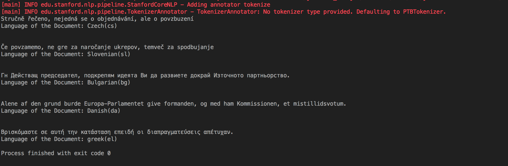{: .center-image }

<b>Sample results using N-grams</b>

 

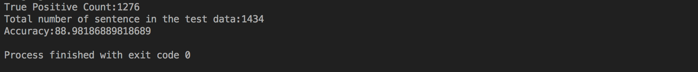{: .center-image }

<b>Accuracy using N-grams</b>

 

## Deep Neural Network Model

The N-Gram model detects the language of the given text with an accuracy of 85% for a large input text. However, the as soon as the size of the input text decreases, the accuracy decreases. To tackle this problem, we use a deep neural network to identify the language of a short text (140 characters e.g. tweets or SMS) with a high accuracy. 

Neural networks are a set of algorithms, modeled loosely after the human brain, that are designed to recognize patterns. Deep-learning networks are distinguished from the single-hidden-layer neural networks by their depth; that is, the number of node layers through which data passes in a multistep process of pattern recognition. Here, we use a 3-layer deep neural network to detect the language of a given text.
 
We use the letter frequency approach for language detection using neural networks to achieve the highest possible accuracy. We count the occurrence frequency of all the possible letters in a sample text string. Assuming we have 7 languages, we exactly know which letters can occur in such texts. List of such letters is just sum of alphabets of all these languages, without letters repetitions. And for each letter in such alphabet, we can count its occurrence in a sample text.

### Raw Data Preparation

Before we implement this neural network, we need to prepare the data. We use a big block of text for each language that we want to identify and sample randomly from each block during our DNN training, validation and test. For this project, we’ve used a European language dataset with 7 languages which are very similar to each other, and therefore challenging for language identification.

We create 4 subfolders – original, cleaned, samples and train_test. The raw data is stored in the ‘original’ subfolder, the cleaned data would be stored in the ‘cleaned’ subfolder, ‘samples’ subfolder is for the files with text samples processed according to sampling procedure and the ‘train_test’ subfolder is for the file with np.arrays prepared for NN train and test data.

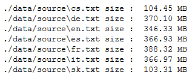{: .center-image }

<b>Raw Data</b>

 

In this step, we create text-cleaning procedures to clean the training data as well as the text that we want to classify, before the classification be trained DNN. Text cleaning procedures include removing XML tags, removing new lines, replacing many spaces with one space, etc.

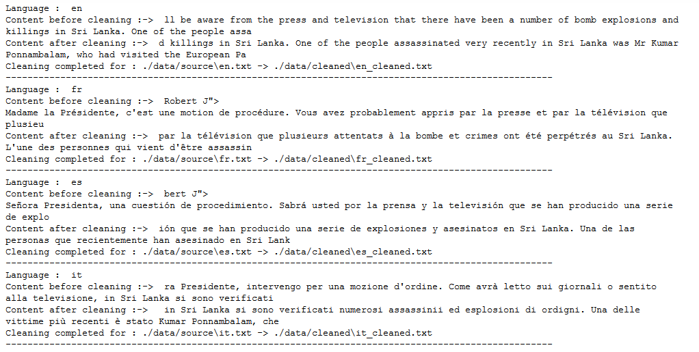{: .center-image }

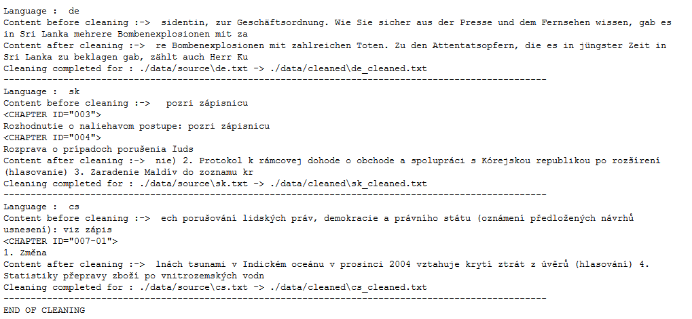{: .center-image }

<b> After cleaning the raw data</b>

 

### Input Data Preparation

In this step, the input data is processed before being fed into the neural network. Only the alpha characters and some special characters are needed from the input sequence to predict the output. We count the number of special characters in the input sample from a predefined alphabet set. Numbers and other special characters such as dot or coma aren’t considered as they are same in all the languages and hence, they don’t provide any additional information for the classification task.

#### Processed Input Data:

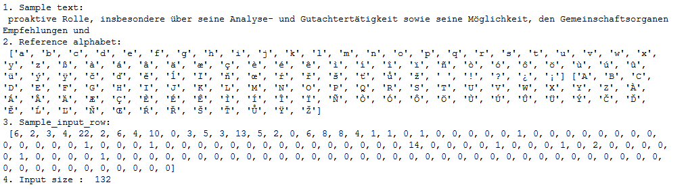{: .center-image }

<b>Processed Input Data</b>

 

Also, we scale the data to ensure that the optimization algorithm (variation of gradient descent) converges well. Thus, this step processes the input sequence and returns a sample input row for the DNN.

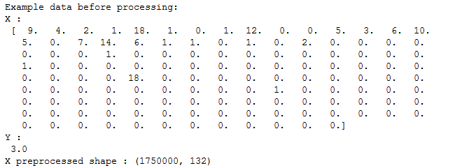{: .center-image }

<b>Data before processing</b>

 

{: .center-image }
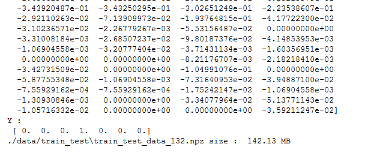{: .center-image }

<b>Data after processing</b>

 

### Architecture of the Neural Network
From the previous Section, we see that the model gets 132 features. Recalling that there are 1400000 training examples and 350000 testing examples, we input the training examples into the Deep NN. We used Keras with Tensorflow to achieve this task.  
After every layer we add a dropout which is a simple technique used to prevent overfitting.
1. The first Layer has 132 input nodes connected with 500 hidden layer nodes.
2. Next we insert 300 hidden layer nodes.
3. After that, another 100 hidden layer nodes.
4. We have 7 neurons in the output layer for each of the 7 classes. 

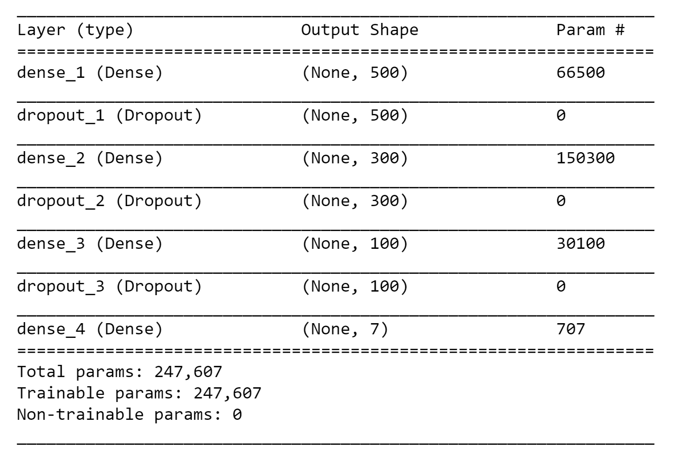{: .center-image }

<b>Architecture using model.summary()</b>

 

### Results of DNN

Below we can see that accuracy is increasing as the number of epochs increase, but after 1 epoch the rate of increase is not high for the test set.

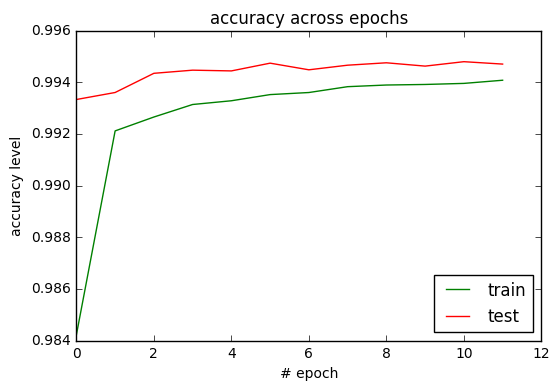{: .center-image }

<b>Accuracy VS Epoch</b>

 

Below we have given the loss vs epoch plot. We can similarly say that, after the 1st epoch, loss is not reduced much because the model already learned sufficient parameters to classify.

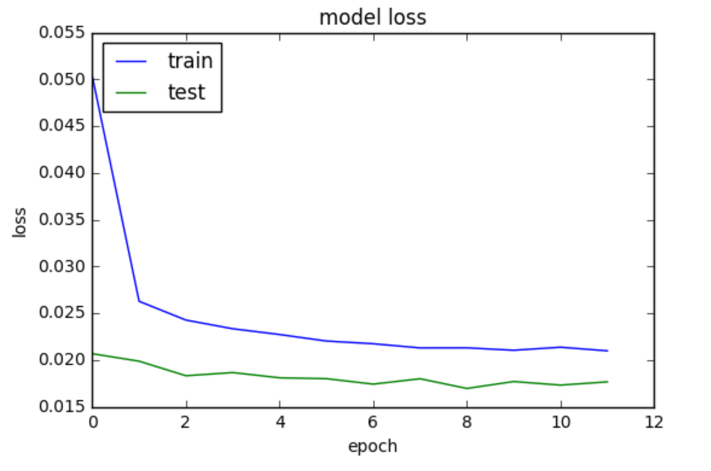{: .center-image }

<b>Loss VS Epoch</b>

 

We show the prediction of sample sentences on various languages below.

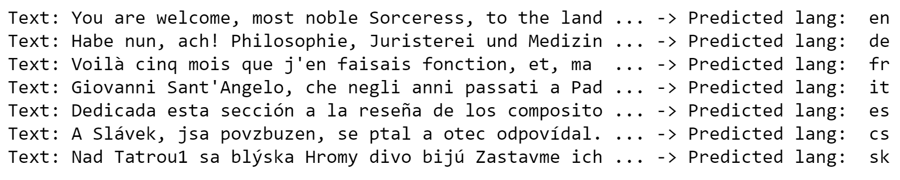{: .center-image }

<b>Illustration of Test sentences</b>

 

## Results

The N-grams approach achieved an average accuracy of ~89% for the test set. It was observed that our prediction model misclassified appreciable amount of sentences for which the length was less. It couldn't find a match in the language profile and made a mistake.

The deep neural network achieved an accuracy of 99%. This shows the exceptional capability of Deep learning. Just by adding 3-4 dense layers remarkable results were obtained.
But of course, you have to take care of other factors too, viz overfitting, train-test split etc...

One of the examples that was misclassified by N-gram model was "Bylo zde zmíněno, že toto soutěžení nebylo příliš velké, alespoň ne dosud" which is actually Czech but the model predicted it as Slovak because the languages are very similar. Below is the image that shows the incorrect language detected by the N-gram model:

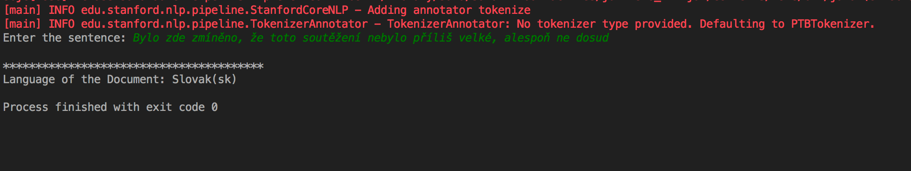{: .center-image }

<b>Result of N-gram language detection model on Czech sentence</b>

   

However, our deep neural network is able to correctly detect the language as Czech.

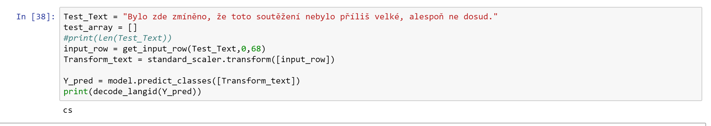{: .center-image }

<b>Result of Deep Neural Network language detection model on Czech sentence</b>

  

## Conclusion

By comparing the two approaches, we conclude that deep neural network surpasses the N-gram approach for language detection in almost all aspects. With a decent GPU you could train the net in a short time and see the magic it does.

For the N-gram approach, including the unigrams in the language profile too may help in correctly classifying even the short sentences in the data. Furthermore tuning the hyperparameters on a validation set may further bring an improvement in the accuracy. 

## References

1. Gyawali, Binod, Gabriela Ramírez-de-la-Rosa, and Thamar Solorio. "Native Language Identification: a Simple n-gram Based Approach." BEA@ NAACL-HLT. 2013.
2. Carlos Ramisch. “N-gram models for language detection.”
3. http://cloudmark.github.io/Language-Detection/
4. Kadri, Said, and Abdelouahab Moussaoui. "An effective method to recognize the language of a text in a collection of multilingual documents." Electronics, Computer and     	   Computation (ICECCO), 2013 International Conference on. IEEE, 2013.
5. Cavnar, W. B., & Trenkle, J. M. (1994). N-gram-based text categorization. Ann Arbor MI, 48113(2), 161-175.
6. Dunning, T. (1994). Statistical identification of language (pp. 94-273). Computing Research Laboratory, New Mexico State University.
7. Rehurek, R., & Kolkus, M. (2009, January). Language identification on the web: Extending the dictionary method. In CICLing (pp. 357-368).

